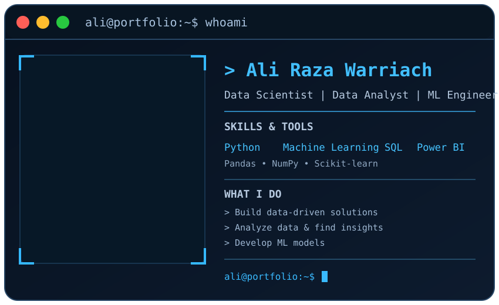
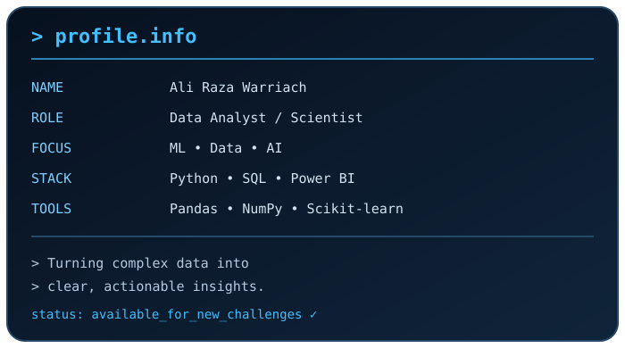

<!-- PROFILE HEADER -->

--------

<!--
<table align="center">
  <tr>
    <td align="center" valign="top">
      
    </td>
    <td align="center" valign="top">
      
    </td>
  </tr>
</table>
-->

## 💻 About Me

📊 **Data Analyst** | 🤖 **Machine Learning Enthusiast** | 🐍 **Python Developer**

* 👨‍💻 I work with **Python, SQL, Power BI, and data analysis** to turn raw data into meaningful insights.
* 📈 I enjoy **data cleaning, exploratory data analysis, visualization, dashboards, and reporting**.
* 🧠 Currently strengthening my skills in **Machine Learning, feature engineering, model evaluation, and predictive analytics**.
* 🎯 My goal: Build **data-driven solutions** that transform complex datasets into clear and useful insights.
* 🧩 Tech stack: **Python • SQL • Power BI • Pandas • NumPy • Scikit-learn • Excel • Flutter • Firebase • Figma**
* ⚡ **Fun Fact:** I can spend hours cleaning a dataset just to make one perfect visualization! 😄

---

## 🧠 What I'm Doing These Days

* 🔭 Building practical **Data Analytics & Machine Learning projects**
* 📊 Creating interactive **Power BI dashboards and data visualizations**
* 🐍 Working with **Python, Pandas, NumPy, Matplotlib, and Seaborn**
* 🗄️ Practicing **SQL, data cleaning, transformation, and exploratory data analysis**
* 🤖 Exploring **Machine Learning, regression, classification, clustering, and model evaluation**
* 🎨 Using my previous **Flutter, Firebase, and Figma** experience to build data-driven applications

  

## 🛠️ Languages & Tools

   

<!-- 

  

 

  
  
  
  
  
  
  

   

  <b>
    Python • SQL • Power BI • Pandas • NumPy • Matplotlib • Seaborn •
    Scikit-learn • Microsoft Excel
  </b>

 

  

  <b>Python • SQL • Power BI • Pandas • NumPy • Matplotlib • Seaborn • Scikit-learn • Microsoft Excel</b>

  

